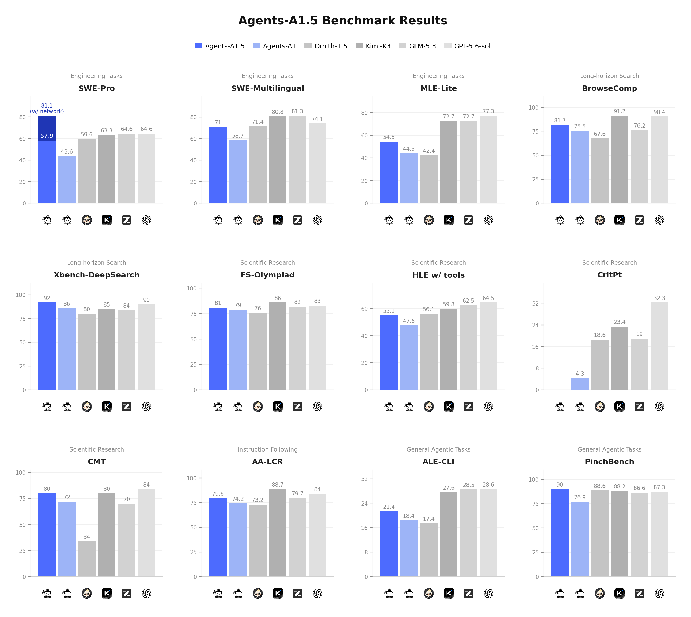

# Agents-A1.5: Scaling the Horizon, Not the Parameters

<div align="center" style="line-height:1">
  <a href="https://github.com/Alpha-Innovator/Agents-A1.5/blob/main/LICENSE" target="_blank"></a>
</div>

<div align="center" style="line-height: 1;">
  <a href="https://huggingface.co/collections/Alpha-Innovator/agents-a15" target="_blank"></a>
  <a href="https://modelscope.cn/models/Alpha-Innovator/Agents-A1.5" target="_blank"></a>
</div>

<p align="center">
<b>&nbsp;&nbsp;&nbsp;&nbsp;&nbsp;🏠&nbsp;&nbsp;<a href="https://alpha-innovator.github.io/Agents-A1.5/">Home Page</a></b>
</p>

---

**Agents-A1.5** is a 35B Mixture-of-Experts Agentic Model that builds on the foundation of [Agents-A1](https://github.com/InternScience/Agents-A1), delivering enhanced capabilities across engineering, long-horizon search, scientific research, instruction following, and general agentic tasks.

## Key Features

### Swarm Mode

Orchestrates parallel investigations across subagents with independent contexts, enabling them to challenge assumptions, refine conclusions through evidence, and synthesize their findings into comprehensive results.

### Verification Mode

An opt-in self-review capability that lives inside the model's own chain of thought — the model pauses mid-trajectory to review what it has established and what has failed, then acts on a revised direction in the same turn, with no external critic.

### Engineering

Solves complex software engineering tasks end-to-end, from understanding codebases and writing patches to running tests across multiple languages and frameworks.

### Scientific Research

Tackles multidisciplinary scientific problems by combining domain reasoning, literature retrieval, data analysis, and evidence verification across physics, chemistry, biology, and beyond.

### General Agentic Tasks

Handles diverse long-horizon agent workflows including tool calling, web browsing, instruction following, and multi-step planning in open-ended environments.

## Performance

We evaluate Agents-A1.5 across engineering tasks, long-horizon search, scientific research, instruction following, and general agentic tasks. Despite operating in the ~35B model class, Agents-A1.5 delivers highly competitive performance against frontier-scale systems.



## Usage

### SGLang

[SGLang](https://github.com/sgl-project/sglang) is a fast serving framework for large language models and vision language models.

Install SGLang with uv:

```shell
uv venv --python 3.12 --seed --managed-python
source .venv/bin/activate

uv pip install sglang
```

See [its documentation](https://docs.sglang.ai/get_started/install.html) for more details.

The following commands create API endpoints at `http://localhost:8000/v1`:

- **Standard Version** (1 GPUs, 262K context):

  ```shell
  python -m sglang.launch_server \
    --model-path Alpha-Innovator/Agents-A1.5 \
    --port 8000 \
    --tp-size 1 \
    --mem-fraction-static 0.8 \
    --context-length 262144 \
    --reasoning-parser qwen3
  ```
- **Tool Use**:

  ```shell
  python -m sglang.launch_server \
    --model-path Alpha-Innovator/Agents-A1.5 \
    --port 8000 \
    --tp-size 1 \
    --mem-fraction-static 0.8 \
    --context-length 262144 \
    --reasoning-parser qwen3 \
    --tool-call-parser qwen3_coder
  ```

### vLLM

[vLLM](https://github.com/vllm-project/vllm) is a high-throughput and memory-efficient inference and serving engine for LLMs.

Install vLLM from the main branch via uv:

```shell
uv venv --python 3.12 --seed --managed-python
source .venv/bin/activate

uv pip install vllm --torch-backend=auto
```

See [its documentation](https://docs.vllm.ai/en/stable/getting_started/installation/index.html) for more details.

The following commands create API endpoints at `http://localhost:8000/v1`:

- **Standard Version** (1 GPUs, 262K context):

  ```shell
  vllm serve Alpha-Innovator/Agents-A1.5 \
    --port 8000 \
    --tensor-parallel-size 1 \
    --max-model-len 262144 \
    --reasoning-parser qwen3
  ```
- **Tool Call**:

  ```shell
  vllm serve Alpha-Innovator/Agents-A1.5 \
    --port 8000 \
    --tensor-parallel-size 1 \
    --max-model-len 262144 \
    --reasoning-parser qwen3 \
    --enable-auto-tool-choice \
    --tool-call-parser qwen3_coder
  ```

### Recommended Sampling Parameters

For the best generation quality, we recommend the following sampling parameters:

- `temperature`: 0.85
- `top_p`: 0.95
- `top_k`: 20
- `min_p`: 0.0
- `presence_penalty`: 1.1
- `repetition_penalty`: 1.0

## Related Projects

- [Agents-A1](https://github.com/InternScience/Agents-A1) — Our previous 35B MoE agentic model for long-horizon search, engineering, and scientific research.
- [MLEvolve](https://github.com/InternScience/MLEvolve) — Automated machine learning workflows and model evolution.
- [Agents-K1](https://github.com/InternScience/Agents-K1) — Agent capabilities and reasoning.
