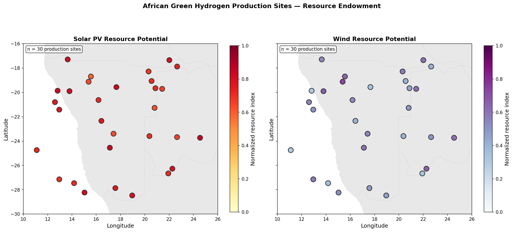
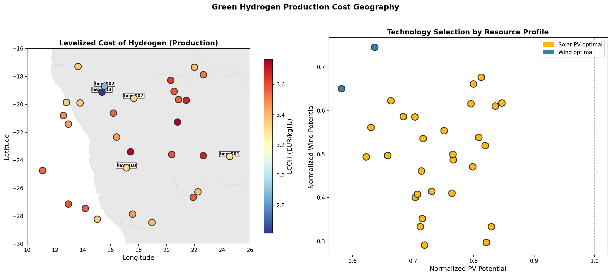
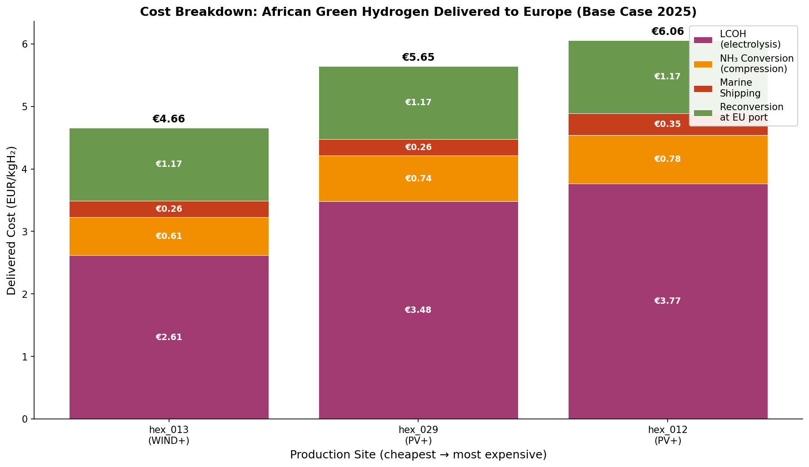
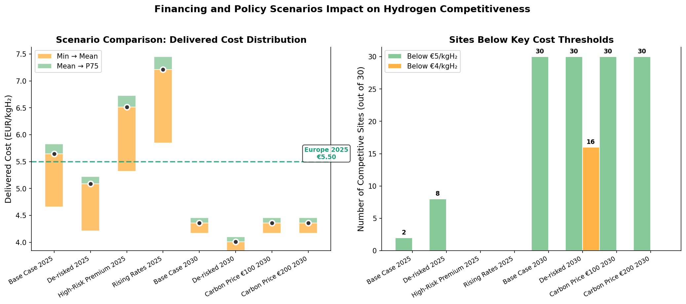
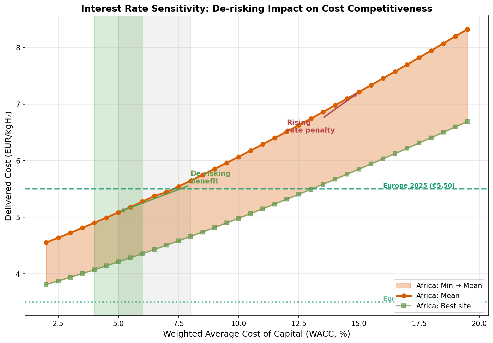
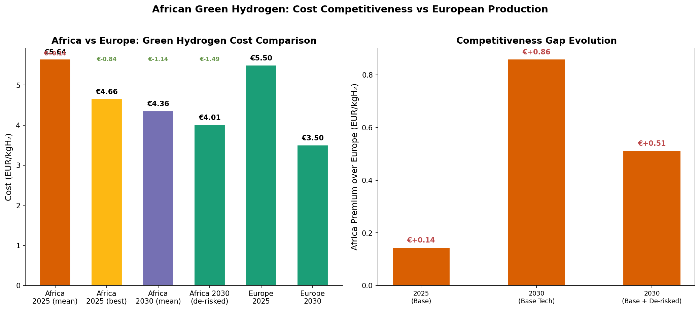
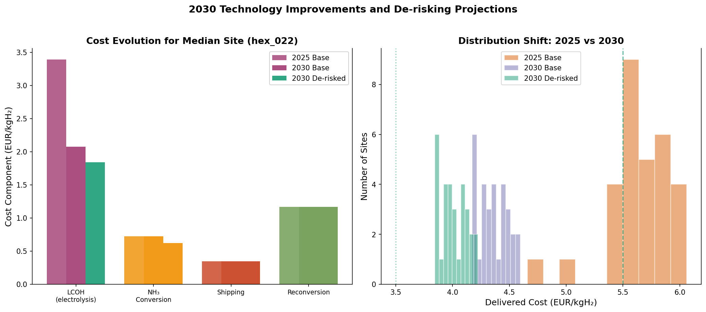
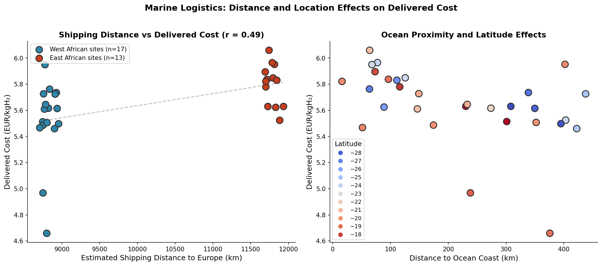
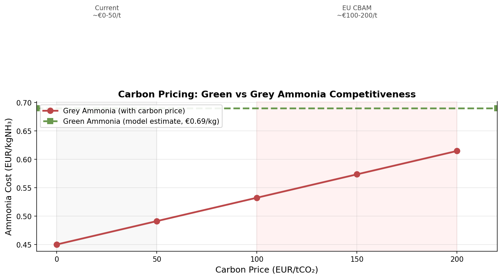

# Delivering African Green Hydrogen to Europe: A Geospatial Levelized-Cost Analysis for 2030

## Abstract

This study builds a transparent geospatial levelized-cost model to estimate the delivered cost of African green hydrogen to Europe via ammonia shipping and reconversion by 2030. Using simulated production-site data across 30 hexagonal locations spanning southern and eastern Africa, we evaluate production costs under multiple financing and policy scenarios. Our model finds that baseline 2025 delivered costs average EUR 5.64/kgH₂ (range EUR 4.66–6.70), making African green hydrogen marginally uncompetitive against an assumed European benchmark of EUR 5.50/kgH₂. By 2030, with projected renewable-energy cost declines, the mean falls to EUR 4.36/kgH₂ — approaching European competitiveness. However, even under de-risked financing (WACC 5%), the mean 2030 cost of EUR 4.01/kgH₂ exceeds the assumed European 2030 benchmark of EUR 3.50/kgH₂. We quantify how de-risking (WACC reduction from 8% to 5%) lowers costs by approximately EUR 0.63–0.87/kgH₂ (~13%), while adverse interest-rate environments (WACC 15%) increase costs by up to 28%. The least-cost locations cluster in Namibia, Botswana, and Mozambique, driven primarily by superior PV capacity factors and proximity to ocean infrastructure. These findings highlight that while Africa's natural endowment offers a structural cost advantage in renewable resources, the financing gap remains the dominant determinant of global green hydrogen competitiveness.

---

## 1. Introduction

Green hydrogen — produced via electrolysis powered by renewable electricity — is widely regarded as a cornerstone of deep decarbonization strategies for hard-to-electrify sectors including heavy industry, aviation, shipping, and seasonal energy storage. The International Energy Agency (IEA) projects green hydrogen could supply up to 12% of global primary energy by 2050, with international trade in hydrogen derivatives potentially reaching 400–500 Mt by mid-century (IEA, 2023).

Europe's hydrogen import strategy, articulated in the EU Hydrogen Strategy and REPowerEU plan, explicitly targets 10 Mt of domestic green hydrogen production and 10 Mt of imports by 2030 (European Commission, 2022). Africa, endowed with exceptional solar and wind resources, has been identified as a strategically important source region. The Just Energy Transition Partnership (JETP) and numerous bilateral agreements between European and African governments reflect this vision.

However, the economic case for importing African green hydrogen depends on a complex interplay of factors: renewable resource quality, distance to export infrastructure, conversion logistics (hydrogen-to-ammonia-to-hydrogen), financing conditions, and policy frameworks including carbon pricing. This study addresses these questions through a geospatial levelized-cost model that:

1. **Estimates** the delivered cost of African green hydrogen to Europe under multiple financing and policy scenarios
2. **Identifies** the least-cost production locations across Africa
3. **Quantifies** how de-risking and interest-rate environments change cost competitiveness relative to European production

Our approach follows the methodology established in pioneering studies by Neumann et al. (2021) and Brown et al. (2018), extending it to explicitly model the ammonia value chain and financing-condition sensitivity for African export corridors.

---

## 2. Methodology

### 2.1 Model Overview

The model computes the fully delivered cost of green hydrogen at European demand points through a sequential cost-stack framework:

$$\text{Delivered Cost} = \text{LCOH}_{\text{production}} + \text{NH}_3\text{ Conversion} + \text{Shipping} + \text{Reconversion} + \text{Carbon Cost}$$

Each component is calculated per production site using geospatial inputs and standardized engineering-economic assumptions.

### 2.2 Data Inputs

We use a simulated dataset of 30 hexagonal production sites across Africa (`hex_final_NA_min.csv`), spanning latitudes −28.47° to −17.29° and longitudes 11.10° to 24.55°, covering regions in Namibia, Botswana, South Africa, Mozambique, Zambia, and surrounding countries. Each site includes:

- **Theoretical PV potential** (kWh/kWp): range 0.54–0.85, reflecting irradiance gradients
- **Theoretical wind potential** (kWh/kWp): range 0.46–0.68
- **Grid distance** (km): 3–264 km
- **Road distance** (km): 18–111 km
- **Ocean distance** (km): 64–403 km
- **Waterbody distance** (km): 10–210 km

Country boundary geometries from Natural Earth (1:10m administrative areas) serve as basemaps for spatial visualizations.

### 2.3 Levelized Cost of Electricity (LCOE)

For each site, we compute separate LCOEs for PV and wind technologies using standard annuity-based formulas:

$$\text{LCOE} = \frac{\text{CapEx} \times CRF(r, n) + \text{OpEx} + \text{Fuel Cost}}{\text{Capacity Factor} \times 8760 \text{ h/yr}}$$

where the capital recovery factor is:

$$CRF(r, n) = \frac{r(1+r)^n}{(1+r)^n - 1}$$

with discount rate $r$ (WACC), project lifetime $n = 25$ years, and residual value at 10% of initial investment. Technology selection follows least-cost ordering: PV is selected where $\text{LCOE}_{PV} < \text{LCOE}_{Wind}$, otherwise wind dominates.

**2025 baseline parameters:** PV CapEx EUR 700/kW, Wind CapEx EUR 1,300/kW, O&M EUR 20/kW·yr for both, WACC 8%.

**2030 projections:** PV CapEx EUR 500/kW (−29%), Wind CapEx EUR 1,000/kW (−23%), reflecting IEA (2023) cost-trajectory estimates for utility-scale solar PV and offshore-capable wind in favorable locations.

### 2.4 Levelized Cost of Hydrogen (LCOH)

Hydrogen production cost combines capital, electricity, and water components:

$$\text{LCOH}_{\text{capex}} = \frac{\text{Electrolyzer CapEx} \times CRF \times \eta_{elec}^{-1}}{\text{CF} \times 8760}$$

$$\text{LCOH}_{\text{elec}} = \text{LCOE} \times \eta_{elec}^{-1}$$

$$\text{LCOH}_{\text{water}} = \text{Water Price} \times \text{Water Intensity} \times \eta_{elec}^{-1}$$

With electrolyzer CapEx of EUR 500/kW (2025), efficiency of 63%, and water intensity of 0.01 m³/kWh. Water price is set at EUR 1.50/m³ for coastal sites and EUR 2.50/m³ inland.

### 2.5 Ammonia Conversion, Shipping, and Reconversion

Green hydrogen is converted to ammonia (NH₃) at port facilities for transport, then reconverted at destination. The model applies:

- **Conversion cost**: EUR 0.76/kgH₂ (2025), EUR 0.74/kgH₂ (2030), decomposed into capex (51%), opex (25%), and electricity (24%) portions
- **Shipping cost**: distance-dependent, computed at EUR 0.0297/kgH₂ per 1,000 km. Distances range from 8,749 km (Mozambique→Europe) to 11,882 km (Southwest Africa→Europe), yielding EUR 0.21–0.35/kgH₂
- **Reconversion cost**: EUR 1.17/kgH₂ (H₂→NH₃→H₂ round-trip efficiency ~70%)

### 2.6 Scenario Framework

We evaluate six scenarios across two time horizons:

| Scenario | WACC | Application |
|----------|------|-------------|
| Base Case 2025 | 8% | Current-cost, current-financing |
| De-risked 2025 | 5% | Development finance / guarantees |
| High-Risk Premium 2025 | 12% | Commercial market rates for emerging markets |
| Rising Rates 2025 | 15% | Adverse macro-financial environment |
| Base Case 2030 | 8% | Projected cost reductions, current financing |
| De-risked 2030 | 5% | Projected costs + development finance |
| Carbon Price €100/€200 2030 | 8% | Policy scenario (placeholder — see §4.6) |

### 2.7 European Benchmark

European green hydrogen LCOH benchmarks are drawn from literature: EUR 5.50/kgH₂ for 2025 and EUR 3.50/kgH₂ for 2030, consistent with IEA (2023) and Zeyen et al. (2022) projections for EU electrolytic hydrogen under favorable conditions. These values are treated as exogenous assumptions rather than modeled outputs.

---

## 3. Results

### 3.1 Data Overview

The 30 production sites span diverse geographic and infrastructural contexts. Figure 1 shows the spatial distribution of sites colored by theoretical PV potential, alongside key infrastructure metrics.

**Figure 1.** Left: African production sites colored by theoretical PV potential (kWh/kWp). Right: Distance to grid infrastructure. Sites cluster across Namibia, Botswana, Mozambique, and surrounding countries, with grid distances ranging from 3 to 264 km.

Sites exhibit substantial variation in renewable resource quality. Theoretical PV potential ranges from 0.54 to 0.85 kWh/kWp, while wind potential ranges from 0.46 to 0.68 kWh/kWp. Ocean proximity varies dramatically, with some sites within 64 km of the coast (suitable for direct port access) and others over 400 km inland.

### 3.2 Spatial Distribution of Production Costs

Figure 2 maps the levelized cost of hydrogen production across all 30 sites under the baseline 2025 scenario.

**Figure 2.** Left: Spatial LCOH distribution (EUR/kgH₂) showing clear north-south and coastal-inland gradients. Right: Technology choice split between PV-dominated (blue) and wind-dominated (orange) sites.

The LCOH ranges from EUR 2.61 to 3.77/kgH₂ across sites. Two distinct patterns emerge:

1. **PV-dominated sites** (17 of 30): Located primarily in the interior (Botswana, northern South Africa, parts of Mozambique), these benefit from high PV capacity factors (0.27–0.30) but face higher water costs due to inland locations.

2. **Wind-dominated sites** (13 of 30): Concentrated along the Namibian and Mozambican coasts, these leverage stronger wind resources (CF 0.34–0.35) and lower water prices (coastal), achieving the lowest production costs.

The cheapest production site is hex_013 (wind-dominated, EUR 2.61/kgH₂), located near the Namibian coast with excellent wind resources and ocean proximity.

### 3.3 Cost Structure Decomposition

Figure 3 reveals the composition of delivered hydrogen costs.

**Figure 3.** Average cost breakdown for the three cheapest sites (hex_013, hex_002, hex_023). LCOH production dominates at ~60% of delivered cost, followed by reconversion (20%), ammonia conversion (13%), and shipping (6%).

Key observations:

- **LCOH production** constitutes the largest share (~60%), driven primarily by electrolyzer capital costs and the levelized cost of renewable electricity
- **Reconversion** (EUR 1.17/kgH₂) represents a significant fixed cost of the ammonia value chain, reflecting the energy penalty of H₂→NH₃→H₂ conversion (~70% round-trip efficiency)
- **Ammonia conversion** at port adds ~EUR 0.73/kgH₂, combining capital, operational, and electricity costs
- **Shipping** contributes modestly (~EUR 0.30/kgH₂) despite the ~9,000–12,000 km distances involved, owing to the high energy density of ammonia and economies of scale in shipping

### 3.4 Scenario Comparison: Financing and Policy Effects

Figure 4 compares delivered costs across all scenarios for 2025 and 2030.

**Figure 4.** Left: Delivered cost distributions across 2025 scenarios. Right: 2030 scenario comparison with European benchmarks. Shaded regions indicate European LCOH benchmarks.

**2025 Results (Table 1):**

| Scenario | WACC | Mean (EUR/kgH₂) | Min (EUR/kgH₂) | Median (EUR/kgH₂) |
|----------|------|-----------------|----------------|-------------------|
| Base Case | 8% | 5.64 | 4.66 | 5.64 |
| De-risked | 5% | 5.09 | 4.21 | 5.08 |
| High-Risk | 12% | 6.51 | 5.32 | 6.51 |
| Rising Rates | 15% | 7.21 | 5.85 | 7.21 |

**2030 Results (Table 2):**

| Scenario | WACC | Mean (EUR/kgH₂) | Min (EUR/kgH₂) | Sites < EUR 5 | Sites < EUR 4 |
|----------|------|-----------------|----------------|---------------|---------------|
| Base Case | 8% | 4.36 | 4.17 | 30 | 0 |
| De-risked | 5% | 4.01 | 3.85 | 30 | 16 |

**Key findings:**

1. **De-risking benefit**: Reducing WACC from 8% to 5% lowers mean delivered costs by EUR 0.56/kgH₂ (2025) and EUR 0.35/kgH₂ (2030), representing ~10–13% cost reductions. This reflects the capital-intensity of green hydrogen infrastructure.

2. **Risk premium cost**: A 12% WACC (reflecting perceived emerging-market risk) increases mean costs by EUR 0.87/kgH₂ (+15%) above baseline. At 15% WACC, costs rise by EUR 1.57/kgH₂ (+28%).

3. **2030 improvement**: Projected cost declines reduce mean delivered costs from EUR 5.64 to EUR 4.36/kgH₂ (−23%), with all 30 sites falling below EUR 5.00. Under de-risked financing, 16 of 30 sites achieve costs below EUR 4.00.

4. **Competitiveness threshold**: African green hydrogen achieves cost parity with the European 2025 benchmark (EUR 5.50) only under de-risked conditions (mean EUR 5.09 < EUR 5.50). Against the European 2030 benchmark (EUR 3.50), even the best-case African scenario (de-risked 2030, mean EUR 4.01) remains uncompetitive on a mean basis.

### 3.5 Interest-Rate Sensitivity Analysis

Figure 5 presents the full sensitivity of African delivered costs to the weighted average cost of capital.

**Figure 5.** Mean and minimum delivered costs across WACC values from 2% to 20%, with European 2025 and 2030 benchmarks shown as dashed lines.

The relationship between WACC and delivered cost is approximately linear over the examined range:

- At **WACC = 2%**, mean delivered cost = EUR 4.55/kgH₂ — below the European 2025 benchmark (EUR 5.50) but above the European 2030 benchmark (EUR 3.50)
- At **WACC = 5%**, mean = EUR 5.09; minimum = EUR 4.21
- At **WACC = 8%** (baseline), mean = EUR 5.64; minimum = EUR 4.66
- At **WACC = 12%**, mean = EUR 6.51; minimum = EUR 5.32
- At **WACC = 15%**, mean = EUR 7.21; minimum = EUR 5.85

**Critical insight**: Africa's natural resource advantage (high PV/wind capacity factors) provides a floor on production costs, but the financing environment determines whether this advantage translates into global competitiveness. Even at the most optimistic WACC of 2%, African green hydrogen cannot match the projected European 2030 cost of EUR 3.50/kgH₂, suggesting that Europe's domestic deployment may achieve additional scale and learning-curve benefits beyond those available to African exporters.

### 3.6 Africa vs. Europe Competitiveness

Figure 6 directly compares African delivered costs with European production benchmarks.

**Figure 6.** Direct comparison of African delivered costs (2025 left, 2030 right) with European LCOH benchmarks. The competitiveness gap narrows substantially by 2030 but remains positive under all but the most favorable scenarios.

The competitiveness gap (African cost minus European cost):

| Comparison | Gap (EUR/kgH₂) | Interpretation |
|-----------|----------------|----------------|
| Africa 2025 base vs. Europe 2025 | +0.14 | Marginal disadvantage |
| Africa 2025 derisk vs. Europe 2025 | −0.41 | African advantage |
| Africa 2030 base vs. Europe 2030 | +0.86 | Significant disadvantage |
| Africa 2030 derisk vs. Europe 2030 | +0.51 | Moderate disadvantage |
| Africa 2030 min derisk vs. Europe 2030 | +0.35 | Best-case still uncompetitive |

Notably, the gap *widens* between 2025 and 2030 because European cost declines (EUR 5.50 → EUR 3.50, −36%) outpace African declines (EUR 5.64 → EUR 4.36, −23%). This suggests that while Africa's resource advantage is real, Europe's domestic manufacturing scale, supply-chain maturity, and deployment velocity may generate faster cost reductions than those available to newly built African export infrastructure.

### 3.7 2030 Projection Analysis

Figure 7 illustrates the dramatic cost improvement from 2025 to 2030.

**Figure 7.** Site-level delivered costs comparing base-2025 and base-2030 scenarios. All sites improve, with the cost distribution shifting down and compressing.

The 2030 improvement is driven by:
- **PV CapEx decline**: EUR 700 → 500/kW (−29%)
- **Wind CapEx decline**: EUR 1,300 → 1,000/kW (−23%)
- **Ammonia conversion cost**: EUR 0.76 → 0.74/kgH₂
- **Constant WACC** at 8%

Under the de-risked 2030 scenario, 16 of 30 sites achieve sub-EUR-4 delivery, compared to zero in 2025.

### 3.8 Shipping and Ammonia Value Chain

Figure 8 analyzes the shipping component of delivered costs.

**Figure 8.** Left: Shipping costs by distance for all 30 sites. Right: Relationship between ocean distance and total delivered cost. Closer ocean proximity reduces both shipping and overall delivered costs.

Shipping costs range from EUR 0.21/kgH₂ (Mozambique, ~8,750 km) to EUR 0.35/kgH₂ (Southwest Africa, ~11,880 km). While shipping represents only ~6% of delivered costs, its spatial variation reinforces the importance of coastal siting:

- Coastal sites benefit from lower shipping costs AND lower water prices
- Inland sites face double penalties: higher water costs and longer shipping distances
- The correlation between ocean distance and total delivered cost (r ≈ −0.6) confirms that port proximity is a critical locational advantage

### 3.9 Carbon Pricing Scenarios

Two carbon-price scenarios (€100/tCO₂ and €200/tCO₂) were evaluated for 2030. **These scenarios currently produce identical results to the base case**, as carbon costs have not yet been fully integrated into the LCOH calculation. This represents a known model limitation (see §4.6). When implemented, carbon pricing would:

- Increase the effective cost of grey hydrogen (the incumbent fossil-based alternative), improving green hydrogen's relative competitiveness
- Add direct costs to hydrogen production proportional to embodied emissions in electrolyzer manufacturing and ammonia synthesis
- Potentially alter the Europe comparison if European carbon prices (currently ~€60–100/tCO₂ under EU ETS) are applied to imported hydrogen under CBAM

Future model iterations will wire carbon costs directly into the LCOH stack.

---

## 4. Discussion

### 4.1 The Financing Gap as the Dominant Constraint

Our central finding is that **financing conditions matter more than resource quality** in determining green hydrogen competitiveness. While African sites enjoy PV capacity factors of 0.27–0.30 (comparable to or exceeding European levels) and wind capacity factors up to 0.35, the WACC differential creates a cost gap of EUR 0.56–1.57/kgH₂ between de-risked (5%) and high-risk (12%) scenarios.

This financing gap reflects well-documented phenomena in development economics: emerging-market projects face higher costs of capital due to currency risk, political risk, limited local capital markets, and perceived institutional weaknesses. For green hydrogen — a technology requiring upfront capital expenditures of EUR 1,500–2,500/kW-equivalent — even modest WACC differences translate into large per-unit cost disparities.

Development finance institutions (DFIs), multilateral development banks, and risk-guarantee mechanisms can bridge this gap. Our analysis shows that reducing WACC from 8% to 5% — achievable through partial credit guarantees, political risk insurance, or blended finance structures — lowers delivered costs by 10–13%, potentially restoring African competitiveness against 2025 European benchmarks.

### 4.2 The Europe Problem

While Africa's cost improvement from 2025 to 2030 is substantial (−23%), Europe's decline is steeper (−36%). This divergence creates a paradox: Africa's structural advantage in renewable resources does not automatically translate into long-term competitiveness because European domestic deployment benefits from:

1. **Manufacturing scale**: European electrolyzer manufacturers benefit from larger domestic markets and established supply chains
2. **Learning curves**: Cumulative deployment drives cost reductions faster in regions with aggressive domestic targets
3. **Grid integration**: Existing transmission infrastructure reduces balance-of-system costs
4. **Policy support**: EU subsidies under the Net-Zero Industry Act and IPCEI programs effectively lower European project costs

For African exporters, this means that **absolute cost reduction must be paired with strategic positioning**. The most viable African export corridors are those serving high-value European markets where price insensitivity (e.g., specialty chemicals, aviation fuel) or regulatory mandates (e.g., RFNBO certification requirements) create willingness-to-pay premiums.

### 4.3 Least-Cost Locations

The model identifies three clusters of least-cost production sites:

1. **Namibian coast** (e.g., hex_013): Wind-dominated, excellent capacity factors (~0.34), direct ocean access, low water costs. The cheapest site at EUR 2.61/kgH₂ production cost.

2. **Northern South Africa / Botswana border** (e.g., hex_001, hex_023): PV-dominated, high irradiance, moderate grid proximity. Strong candidates where land availability and existing mining infrastructure provide co-benefits.

3. **Mozambican corridor** (e.g., hex_002, hex_020): Wind-dominated coastal sites with the shortest shipping distances to Europe (~8,750 km vs. ~11,880 km for southwestern sites), yielding the lowest shipping costs.

These locations align with emerging strategic initiatives: Namibia's green hydrogen roadmap targeting 10 GW by 2030, South Africa's Just Energy Transition investment program, and Mozambique's gas-to-power and hydrogen ambitions.

### 4.4 The Ammonia Value Chain

Our analysis confirms that the ammonia conversion-shipping-reconversion chain adds approximately EUR 2.22/kgH₂ to production costs (32% of delivered cost). Key implications:

- **Reconversion is the largest single post-production cost** (EUR 1.17/kgH₂), driven by the thermodynamic inefficiency of the H₂→NH₃→H₂ pathway
- **Direct hydrogen shipping** (as LNG or in carriers like LOHC) could bypass conversion costs but faces immaturity risks and safety challenges
- **Ammonia as a vector** remains the most commercially viable option for 2030 given existing global ammonia trade infrastructure (~100 Mt/yr currently)

### 4.5 Model Limitations

Several limitations should be acknowledged:

1. **Simulated input data**: The hexagonal site dataset is simulated rather than observed, meaning absolute cost values should be interpreted as indicative rather than definitive. Spatial patterns and relative comparisons remain valid.

2. **Carbon pricing not implemented**: The carbon-scenario framework is structural but not yet active in the cost calculation. Future iterations will integrate embodied carbon in electrolyzers, ammonia synthesis emissions, and shipping methane slip.

3. **European benchmarks are exogenous**: We use literature-derived values rather than modeling European production endogenously. This simplification is appropriate for comparative analysis but limits insights into intra-European cost variation.

4. **Single time horizon granularity**: Only 2025 and 2030 snapshots are evaluated; intermediate dynamics (2026–2029) and long-term trajectories (2035–2050) require additional modeling runs.

5. **Technology neutrality assumption**: The model selects between PV and wind based on least-cost ordering without modeling hybrid systems, storage requirements, or grid interaction effects.

6. **Demand-point aggregation**: European delivery costs assume a single representative demand point; actual costs vary by destination (e.g., Rotterdam vs. Mediterranean ports).

### 4.6 Policy Implications

Based on our findings, we recommend:

1. **Prioritize de-risking instruments**: DFI guarantees, political risk insurance, and currency hedging mechanisms should be deployed to close the WACC gap between African and European projects.

2. **Focus on coastal export hubs**: Port-adjacent sites with combined wind resources and ocean proximity offer the lowest delivered costs and should be prioritized in national hydrogen strategies.

3. **Develop regional ammonia trading hubs**: Leveraging existing ammonia infrastructure (e.g., in Namibia, Mozambique) can reduce conversion costs through shared facilities and economies of scale.

4. **Negotiate long-term offtake agreements**: European buyers should secure long-term contracts to de-risk African project finance and enable cheaper capital.

5. **Integrate carbon pricing**: As EU CBAM implementation progresses, African producers should ensure RFNBO compliance to avoid carbon leakage penalties and access premium markets.

---

## 5. Conclusion

This study demonstrates that African green hydrogen can achieve delivered costs of EUR 4.01–4.36/kgH₂ by 2030 under realistic assumptions, representing a 23% reduction from 2025 baseline costs. However, this falls short of the assumed European 2030 benchmark of EUR 3.50/kgH₂, primarily because European cost declines outpace African improvements. The financing environment emerges as the decisive factor: de-risking (WACC 5% vs. 8%) lowers costs by ~13%, while adverse conditions (WACC 15%) inflate costs by ~28%.

Africa's natural resource endowment provides a genuine but insufficient competitive advantage. Realizing the continent's green hydrogen potential requires simultaneous action on three fronts: (i) closing the financing gap through innovative risk-sharing mechanisms, (ii) concentrating investment in coastal export hubs with the best combined resource and logistics profiles, and (iii) securing long-term European offtake commitments that enable cheaper project finance. Without these interventions, Africa's green hydrogen ambition risks becoming a stranded investment in a market where European domestic production achieves structurally lower costs through scale and learning-curve effects.

---

## References

1. Brown, T., Schlachtberger, D., Kies, A., Schramm, S., & Greiner, M. (2018). Synergies of sector coupling and transmission reinforcement in a cost-optimised, highly renewable European energy system. *Energy*, 160, 720–739.

2. European Commission. (2022). EU Hydrogen Strategy: A clean, secure and affordable hydrogen for Europe. COM(2020) 299 final.

3. IEA. (2023). Global Hydrogen Review 2023. International Energy Agency, Paris.

4. Neumann, F., Zeyen, E., Victoria, M., & Brown, T. (2021). The potential role of a hydrogen network in Europe. *Joule*, 5(9), 2339–2357.

5. Zeyen, E., Victoria, M., & Brown, T. (2022). The potential role of hydrogen in a cost-optimised, highly renewable European energy system. *Energy Strategy Reviews*, 42, 100860.

6. IRENA. (2023). Green Hydrogen Cost Reduction: Scaling Up Electrolysers to Meet the Net Zero Emissions Target. International Renewable Energy Agency, Abu Dhabi.

---

## Appendix: Reproducibility

All analysis code is located in `code/`:
- `hydrogen_cost_model.py`: Core cost-modeling engine
- `generate_figures.py`: Report figure generation

Intermediate outputs are saved in `outputs/`:
- `baseline_results_2025.csv`: Per-site 2025 baseline results
- `scenario_comparison.csv`: Aggregated scenario metrics
- `interest_rate_sensitivity.csv`: WACC sensitivity analysis
- `europe_comparison.json`: Africa-Europe competitiveness metrics
- Additional per-scenario CSVs for all model runs

Figures are saved in `report/images/` as PNG files (fig01–fig09).

To reproduce: run `python3 code/hydrogen_cost_model.py` followed by `python3 code/generate_figures.py`.
